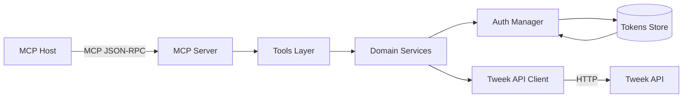

# AI Agent Instructions for tweek-mcp

This document provides essential guidance for AI agents working with the tweek-mcp codebase.

## Project Overview

tweek-mcp is a TypeScript-based Model Context Protocol (MCP) server that integrates with the Tweek API, providing calendar and task management capabilities. The server runs on Node.js (v20+) and uses ESM modules exclusively.

## Architecture

Key components and their responsibilities:

```
src/
├── auth/          # Token lifecycle and Google Identity auth
├── http/          # HTTP client with retry and timeout
├── tools/         # MCP tool implementations
├── tweek/         # Tweek API client and types
├── cli/           # Auth provisioning commands
└── config/        # Environment configuration
```

### Component Flow



Important data flows:
1. Auth flow: `AuthManager` → `TokenStore` → `IdentityClient` for token refresh
2. API requests: `TweekClient` → `HttpClient` → Tweek API with auto-retry
3. Tool calls: MCP Tool classes → `TweekClient` → Response mapping

## Development Workflow

Essential commands:
```bash
pnpm i              # Install dependencies
pnpm auth:signin    # One-time auth setup (required before dev)
pnpm dev            # Start server in watch mode
pnpm test           # Run test suite
```

### Configuration

Required environment variables:
- `TWEEK_API_KEY`: API key for Tweek service

Optional with defaults:
- `TWEEK_API_BASE`: API base URL (default: `https://tweek.so/api/v1`)
- `TWEEK_TOKENS_PATH`: Token storage location (default: `~/.tweek-mcp/tokens.json`)
- `TWEEK_REQUEST_TIMEOUT_MS`: API timeout (default: `30000`)
- `TWEEK_TOKEN_REFRESH_BUFFER_SEC`: Refresh window (default: `60`)
- `TWEEK_ENCRYPTION_KEY`: 32-byte key for token encryption (optional)

## Key Patterns

1. Error handling:
   - Domain errors extend `AppError` with code and details
   - HTTP errors are mapped to structured MCP error types in `src/http/errors.ts`
   - Tool responses use `formatToolResponse` wrapper for consistent shape
   - Sensitive data (tokens, API keys) auto-redacted in logs/traces

2. Authentication:
   - Tokens cached in memory with proactive refresh using configurable buffer
   - File storage with `0600` permissions and optional AES-GCM encryption
   - Clear error guidance for first-time setup

3. Testing:
   - Tests in `src/tests/` follow `*.test.ts` pattern
   - Vitest with Node environment and auto-mock restoration
   - Comprehensive test suite: unit, integration, CLI E2E, and contract tests

4. Security:
   - Tokens stored securely with filesystem permissions
   - Optional encryption for tokens at rest
   - Sensitive headers redacted in logs
   - Auto-refresh to prevent token expiry

## Common Tasks

1. Adding a new tool:
   - Create tool class in `src/tools/` (see `CalendarsTool` as example)
   - Add validation in `src/tools/validation.ts` (ensure sync with Tweek API docs)
   - Register tool instance in `src/index.ts`
   - Add corresponding tests in `src/tests/tools.test.ts`

2. Extending Tweek API client:
   - Add types to `src/tweek/types.ts` (both API and normalized shapes)
   - Create response mapper in `src/tweek/mappers.ts`
   - Add client method to `TweekClient`
   - Update error mapping if needed

3. Authentication and tokens:
   - First-time setup requires `pnpm auth:signin` (interactive) or import
   - Token file stored at `TWEEK_TOKENS_PATH` with `0600` permissions
   - Use `AuthManager` for token operations (avoid direct file access)
   - Add encryption if handling sensitive data
