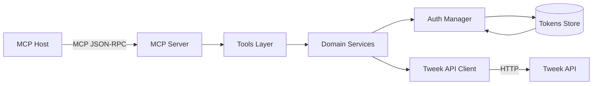
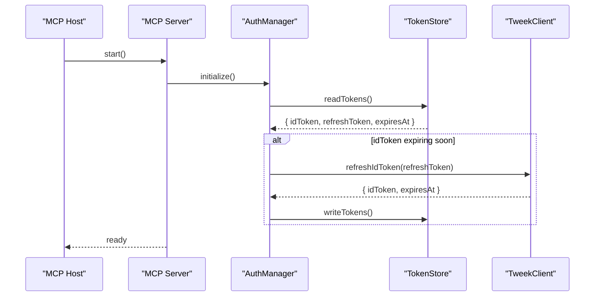
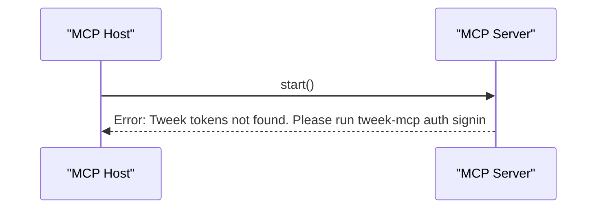
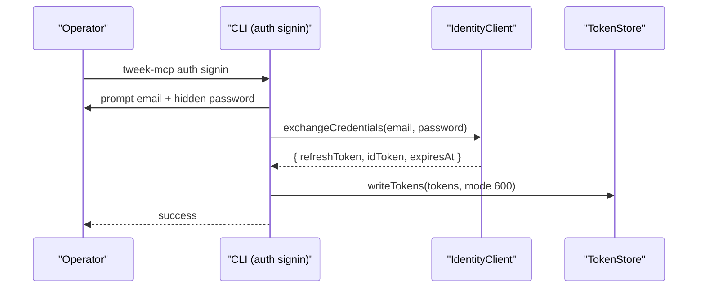
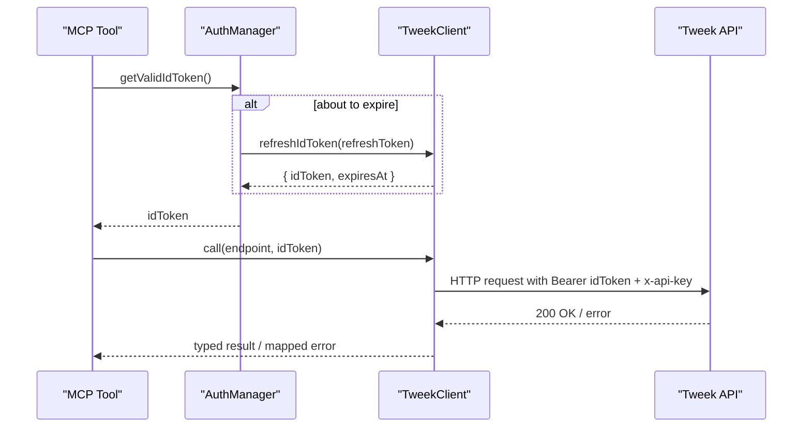
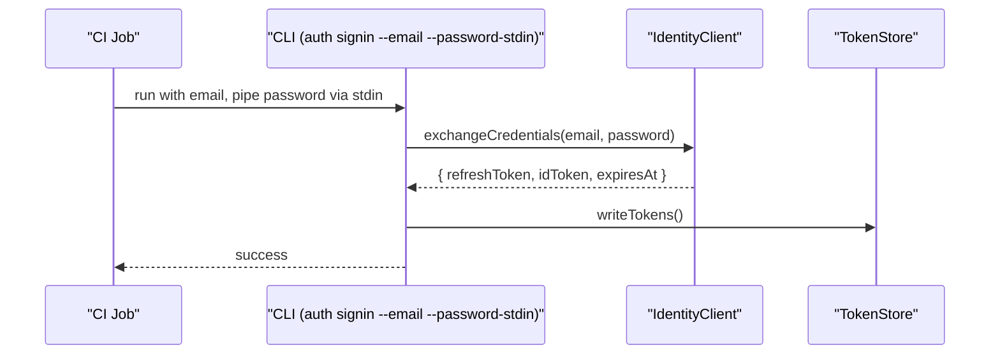

# Tweek MCP Server – Technical Design (TypeScript, ESM, PNPM)

This document describes the architecture, components, request/response flows, and implementation considerations for the Tweek MCP Server that integrates with the Tweek API. It is derived from `specs/requirements.md` and targets a TypeScript codebase using ESM modules and PNPM.

---

## High‑Level Architecture

- **MCP Server Core**: Hosts tools/resources and routes MCP calls to domain services.
- **Auth Subsystem**: Exchanges credentials for tokens, caches tokens, and performs proactive refresh.
- **Tweek API Client**: Thin HTTP client for `https://tweek.so/api/v1`, handling headers, timeouts, retries, and error translation.
- **CLI (Auth Provisioning)**: `tweek-mcp auth signin` and `tweek-mcp auth import` to initialize tokens securely.
- **Persistence**: Local tokens file at `TWEEK_TOKENS_PATH` (permission 600, optional AES‑GCM encryption).
- **Configuration**: Reads env vars and optional config file, provides typed config to subsystems.

### Component Diagram



---

## Modules and Responsibilities

- **`config/`**
  - Load `TWEEK_API_BASE`, `TWEEK_API_KEY`, `TWEEK_TOKENS_PATH`, `TWEEK_ENCRYPTION_KEY`, `TWEEK_REQUEST_TIMEOUT_MS`, `TWEEK_TOKEN_REFRESH_BUFFER_SEC`.
  - Validate and expose typed configuration.

- **`auth/`**
  - `AuthManager`: in-memory token cache, expiry tracking, proactive refresh using `refreshToken` with buffer window.
  - `TokenStore`: read/write tokens file with `0600` permissions; optional AES‑GCM encryption if `TWEEK_ENCRYPTION_KEY` is provided.
  - `IdentityClient`: credential exchange (email/password → `idToken`, `refreshToken`), refresh flow.

- **`http/`**
  - `HttpClient`: wrapper around `fetch`/`undici` with base URL, default headers, timeout, retry policy for idempotent requests.
  - Sensitive header redaction in logs/traces.

- **`tweek/`**
  - `TweekClient`: typed methods for calendars, tasks, custom colors; attaches `Authorization: Bearer {idToken}` and `x-api-key`.
  - Error mapping: HTTP → structured MCP errors (`UNAUTHENTICATED`, `NOT_FOUND`, etc.).

- **`tools/`** (MCP)
  - `listCalendars()`, `listTasks()`, `getTask()`, `createTask()`, `updateTask()`, `deleteTask()`, `getCustomColors()`.
  - Input validation per requirements (freq enum, ISO dates, checklist, calendarId).

- **`cli/`**
  - `auth signin` (interactive and `--email` + `--password-stdin`), `auth import --refresh-token`.

- **`types/`**
  - Shared DTOs and enums for stable inputs/outputs.

---

## Configuration and Defaults

- **Defaults**
  - `TWEEK_API_BASE` = `https://tweek.so/api/v1`
  - `TWEEK_REQUEST_TIMEOUT_MS` = `30000`
  - `TWEEK_TOKEN_REFRESH_BUFFER_SEC` = `60`
  - `TWEEK_TOKENS_PATH` = `~/.tweek-mcp/tokens.json`

- **Required**
  - `TWEEK_API_KEY`

- **Security**
  - If `TWEEK_ENCRYPTION_KEY` (32 bytes) is set, tokens file is encrypted at rest via AES‑GCM.

---

## Sequence Diagrams

### Server Startup (Tokens Present)



### Server Startup (No Tokens)



### Interactive Sign‑In



### Proactive Token Refresh on API Call



### CLI Non‑Interactive Sign‑In (Automation)



---

## Public MCP Surface

- **`listCalendars()`** → `calendars[]` with mapped roles: `ROLE_OWNER`, `ROLE_EDITOR`, `ROLE_VIEWER`.
- **`listTasks({ calendarId, startAt?, dateFrom?, dateTo? })`** → `{ pageSize, nextDocId, data }`.
- **`getTask({ taskId })`** → `task`.
- **`createTask({ task })`** → `{ id }`.
- **`updateTask({ taskId, patch })`** → full updated `task`.
- **`deleteTask({ taskId })`** → `{ success: true }`.
- **`getCustomColors()`** → `colors[]` (extract `userId` from `idToken` claims).

---

## Input Validation Rules (Tasks)

- **`freq`**: if present, must be integer in `[0..7]` (Tweek recurrents enum).
- **`notifyAt`, `date`, `isoDate`, `dtStart`**: if present, must be valid ISO 8601 date/datetime.
- **`calendarId`**: required non-empty string on create.
- **`checklist`**: each item requires a non-empty `text` field.

Implementation: central `validateTaskInput` and `validateTaskPatch` utilities returning typed results or throwing structured validation errors.

---

## Error Handling and Retries

- Map HTTP statuses to MCP errors:
  - `401/403` → `UNAUTHENTICATED`
  - `404` → `NOT_FOUND`
  - `400` → `INVALID_ARGUMENT`
  - `429` → `RESOURCE_EXHAUSTED`
  - `5xx` → `UNAVAILABLE`
- Retry policy (idempotent GET/DELETE only): exponential backoff with jitter; bounded max attempts.
- Never log tokens or API key; redact `Authorization` and `x-api-key`.

---

## Pagination & Filtering

- Forward-only pagination via `nextDocId` from Tweek API; expose as-is.
- Tasks listing supports `startAt`, `dateFrom`, `dateTo` (ISO 8601), and returns page size.
- No total count; clients should implement "Load More" UX.

---

## Security Considerations

- Tokens never logged; secrets redacted in diagnostics.
- Tokens file permissions set to `0600`.
- Optional AES‑GCM encryption with `TWEEK_ENCRYPTION_KEY` (32 bytes).
- Credentials (email/password) used only in memory during sign‑in; never persisted.
- For container deployments, configure `TWEEK_TOKENS_PATH` to a persistent, secure volume.

---

## Implementation Notes (TypeScript, ESM, PNPM)

- **Tooling**
  - Package manager: PNPM.
  - Module format: ESM. Use `"type": "module"` in `package.json`.
  - Transpile with `tsc` targeting Node 20+ (built-in `fetch` or `undici`).
  - Source under `src/`, output to `dist/`.

- **Suggested `tsconfig.json`**

```json
{
  "compilerOptions": {
    "target": "ES2022",
    "module": "ES2022",
    "moduleResolution": "bundler",
    "strict": true,
    "outDir": "dist",
    "rootDir": "src",
    "resolveJsonModule": true,
    "esModuleInterop": true,
    "forceConsistentCasingInFileNames": true,
    "skipLibCheck": true
  },
  "include": ["src/**/*"]
}
```

- **HTTP**
  - Prefer Node 20+ `fetch`; otherwise depend on `undici`.
  - Implement timeout via `AbortController` and `Promise.race` pattern.

- **Build & Run**
  - `pnpm build` → `tsc -p tsconfig.json`
  - `pnpm start` → runs the MCP server from `dist/index.js`.
  - `pnpm auth:signin` → invokes CLI entry for interactive sign‑in.

- **Project Scripts (example)**

```json
{
  "scripts": {
    "build": "tsc -p tsconfig.json",
    "start": "node dist/index.js",
    "dev": "tsx watch src/index.ts",
    "auth:signin": "node dist/cli/auth-signin.js",
    "auth:import": "node dist/cli/auth-import.js",
    "lint": "eslint .",
    "test": "vitest run"
  }
}
```

---

## Folder Structure (proposed)

```text
src/
  config/
    index.ts
  auth/
    authManager.ts
    tokenStore.ts
    identityClient.ts
  http/
    httpClient.ts
    errors.ts
    retry.ts
  tweek/
    tweekClient.ts
    mappers.ts
    types.ts
  tools/
    calendarsTool.ts
    tasksTool.ts
    colorsTool.ts
    validation.ts
  cli/
    auth-signin.ts
    auth-import.ts
  index.ts (server bootstrap)
types/
  index.ts
```

---

## Token Storage and Encryption

- File path defaults to `~/.tweek-mcp/tokens.json` unless overridden.
- JSON structure:

```json
{
  "idToken": "...",
  "refreshToken": "...",
  "expiresAt": 1735689600
}
```

- If `TWEEK_ENCRYPTION_KEY` is set, wrap JSON bytes with AES‑GCM `{ nonce, ciphertext, tag }`. Store along with a version marker for future migrations.

---

## Logging & Observability

- Structured logs with levels; redact `Authorization`, `x-api-key`, and token values.
- Include request method, path, status, duration; sample response bodies only when safe.
- Emit MCP errors with stable codes; include `requestId` correlation if available.

---

## Testing Strategy

- **Unit**: input validators, retry logic, token expiry/refresh, encryption/decryption.
- **Integration**: TweekClient against mock server; AuthManager + TokenStore round‑trip.
- **CLI E2E**: spawn `auth signin` with mocked stdin; verify tokens file and permissions.
- **Contract**: Golden tests for MCP tool inputs/outputs and error mapping.

---

## Risk & Mitigations

- Token leakage in logs → strict redaction and structured logging.
- Clock skew affecting expiry → refresh buffer (default 60s) and monotonic timers.
- CLI credentials exposure → use hidden input and `--password-stdin`; never store credentials.
- Long‑lived refresh token revocation → surface `UNAUTHENTICATED`, guide user to re‑run `auth signin`.

---

## Open Questions

- Do we need proxy support for outbound HTTP? If yes, add optional proxy config.
- Should we support alternative token storage backends (e.g., OS keychain) in addition to file?
